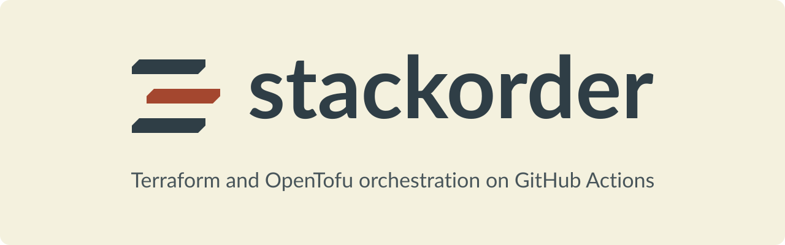

<picture>
  <source media="(prefers-color-scheme: dark)" srcset="assets/banner-dark.svg">
  <source media="(prefers-color-scheme: light)" srcset="assets/banner-light.svg">
  
</picture>

  <a href="https://stackorder.io">Website</a> ·
  <a href="https://docs.stackorder.io">Documentation</a> ·
  <a href="https://docs.stackorder.io/guide/getting-started">Getting started</a> ·
  <a href="https://stackorder.io/brand">Brand guide</a>

Stackorder is lightweight Terraform and OpenTofu orchestration on GitHub Actions. A GitHub App and a small control-plane server work out which stacks a change affects and the order to apply them in, and GitHub Actions does all of the running. Credentials, state and modules stay in your GitHub organisation and your AWS account; the server only ever sees metadata.

## How it works

1. **Pull request plans.** Every push to a pull request scans the repository, sends the dependency graph to the server and plans each affected stack on your own runners. You get one check per stack and one sticky comment.
2. **Apply gate.** A `stackorder apply` comment, or the merge, is checked for who asked, approvals, fresh plans on the head commit, policy checks and stack locks. Every failure is reported together in one comment.
3. **Dependency waves.** Applies run one wave at a time in the order set by `depends_on` and `terraform_remote_state` edges. Each job runs under the stack's GitHub environment, and a failed stack blocks its dependents.
4. **Drift.** On a schedule, the server plans every stack at the head of the default branch and can open one GitHub issue per drifted stack.

The server coordinates and never executes: it holds no cloud credentials, no state and no plan files with secrets. If it is down, pull request plans still run and only applies pause.

## Repositories

| Repository | What it holds |
| --- | --- |
| [`stackorder/stackorder`](https://github.com/stackorder/stackorder) | The control-plane server, the `stackorder` CLI, the web UI, the documentation site and the Terraform module that deploys the server |
| [`stackorder/actions`](https://github.com/stackorder/actions) | The `setup`, `resolve`, `plan`, `apply` and `drift` actions and the reusable `plan.yml` and `run.yml` workflows your repositories call |
| [`stackorder/example-infra`](https://github.com/stackorder/example-infra) | A small Terraform monorepo wired for Stackorder, and the target of its end-to-end tests |

## Get started

- [Introduction](https://docs.stackorder.io/guide/introduction): what the server does, and what it deliberately is not.
- [Local demo](https://docs.stackorder.io/guide/local-demo): plan, apply and check drift on one machine, with no GitHub App and no AWS account.
- [Getting started](https://docs.stackorder.io/guide/getting-started): take one repository from nothing to its first `stackorder apply`.
- [How it works](https://docs.stackorder.io/guide/how-it-works): the execution model, the apply gate, waves, locks and drift.
- [`stackorder.yaml`](https://docs.stackorder.io/configuration/stackorder-yaml) and [Security model](https://docs.stackorder.io/reference/security-model): the reference pages to read before production.

## Status

**v0.1.0** is the first release. The CLI builds are on the [`stackorder/stackorder` releases page](https://github.com/stackorder/stackorder/releases), the server image is `ghcr.io/stackorder/stackorder:0.1.0`, and repositories call the workflows as `stackorder/actions@v1`. The [changelog](https://docs.stackorder.io/changelog) lists what shipped and where the code departs from the design.

## Licence

Every Stackorder repository is open source under the [Apache License 2.0](https://www.apache.org/licenses/LICENSE-2.0).
